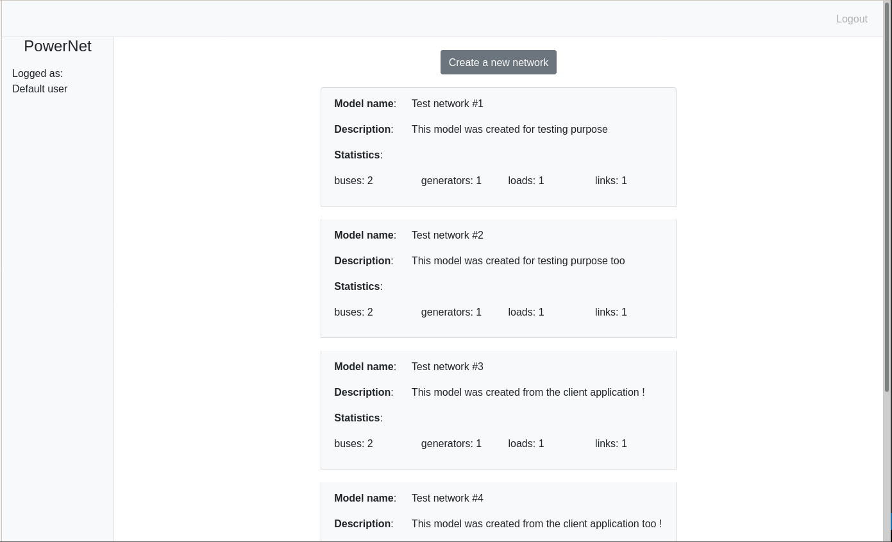

# PowerNet Documentation

## Introduction

What you can do with the application is:

- Get a summary of the network models available on the _PowerNet server_
- Create a new transmission network model

This application consumes the API provided by [PowerNet Server](https://github.com/flaudanum/power-net-server) so be sure that a local instance of it is running.

## Power transmission

Power transmission networks are high voltage networks (usually higher than 66 kV) which purpose is to perform a bulk transmission of energy between generating sites (e.g. power plants, storage) to consumption areas.

Transmission network representation level stops at electrical sub-stations which are the entry point of consumption areas. Such networks are called _distribution networks_.

_PowerNet_ provides modeling features for AC networks only (no DC for now). In such representation the [power is a complex value](https://en.wikipedia.org/wiki/AC_power#Complex_power) which real and imaginary parts are the so-called _active_ and _reactive_ power.

The modeling of transmission networks with _PowerNet_ relies on 4 types of elements:

- buses
- generators
- loads
- links

**Generators** are sources and are used to model the injection of power into networks. It is possible to specify the amount of power injected.

A **load** represents a consumption areas. The power extracted by loads must be specified.

**Links** are the _"pipes"_ of the network. They represent a set of electric lines connecting two buses.

A **Bus** is a connection node between elements of the network. One-terminal elements like generators and loads must be connected to one bus. Links are two-terminal elements and must therefore be connected to different 2 buses.

## Home

The **home view** shows a list of items giving a summary of the network models stored by the _PowerNet server_. For each model, the following information is shown:

- The model's name
- A description of the model
- Some statistics with the numbers of:
  - buses
  - generators
  - loads
  - links

The _Create a new network_ button above these items navigates to the _create a new network view_.

## Create a new network

In the next coming version of the application, suitable forms will be used for modeling networks. A JSON document will then be sent to the _create network_ endpoint of the backend API.

Right now, the JSON document must be built manually, written into the text area. The model is submitted with the button under the text area.

The next section gives an example.

## Creating a 3-bus model

Here is the representation of a 3-bus network.

The JSON document corresponding to this model is in the file [docs/3-bus-network.json](docs/../3-bus-network.json). Copy-paste the content of this document to the text area and submit in order to create a new model.

### Generators

|  Label  |     Name      | Control |
| :-----: | :-----------: | :-----: |
| `gen-0` | Power plant A | _slack_ |
| `gen-1` | Power plant B |   PV    |

[About the control at buses](https://en.wikipedia.org/wiki/Slack_bus#Formulation_of_load_flow_problem).

Generator `gen-0` is provides the _slack bus_ of the networks:

- Voltage magnitude is 1.0 pu
- Voltage angle is 0

Generator `gen-1` has a _PV_ control:

- Active power injection is 60 MW
- Voltage magnitude is 1.02 p.u.

### Load

The one load of the model is labelled `load-0` and named _'Urban area'_. The complex power extraction is:

- Active power extraction of 100 MW
- Reactive power exchange of -10 MVAr

### Links

|  Label   | Lines | Resistance | Reactance | Charging susceptance |
| :------: | :---: | :--------: | :-------: | :------------------: |
| `link-0` | _#0_  |   2.4 Ω    |    6 Ω    |        5e-6 S        |
|          | _#1_  |   2.4 Ω    |    6 Ω    |        5e-6 S        |
| `link-1` | _#0_  |   2.2 Ω    |   5.5 Ω   |       4.4e-6 S       |
|          | _#1_  |   2.3 Ω    |    6 Ω    |        5e-6 S        |
| `link-2` | _#0_  |    3 Ω     |    8 Ω    |        8e-6 S        |
